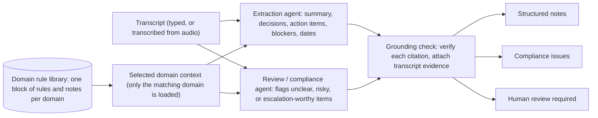
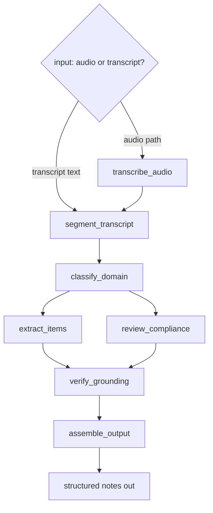

# Architecture & Design Decisions

## The agent architecture

At a high level, two LLM "agents" work off the same call, with domain rules
supplied as context and a deterministic check on everything they produce.

The **extraction agent** reads the call and records what happened: summary,
decisions, action items (with owners and dates), and blockers. The
**review / compliance agent** reads the same call critically, using the rules for
that domain, and flags compliance issues and anything a person should check. A
domain rule library holds one block of rules per domain, and only the block that
matches the call is loaded — the agents get the rules that apply and nothing else.
Everything both agents produce passes through a grounding check that confirms each
citation and attaches the real transcript lines before anything is shown.

## Which workflow pattern this is, and why

Anthropic's *Building Effective Agents* separates two kinds of system: workflows,
where the LLM calls sit on fixed code paths, and agents, where the model directs
its own steps and tool use at run time.
(https://www.anthropic.com/engineering/building-effective-agents)

This system is a **workflow**, on purpose. The steps are known ahead of time —
read the call, work out the domain, extract, review, check citations, assemble —
so there's no reason to let the model choose the path itself. Within that, it uses
two of the patterns the article describes:

- **Routing.** `classify_domain` reads the call, decides its type, and sends it
  down the matching path with the right rules. The article's own routing example
  is sorting different customer queries into different downstream prompts and
  tools, which is close to what the domain router does here.
- **Parallelization (sectioning).** Extraction and compliance are independent
  jobs, so they run as two separate LLM calls at the same time. The article
  suggests this same split for guardrail-style checks — one call does the work
  while another screens it — and notes it tends to work better than asking a
  single call to do both.

There's also a plain-code **gate** on the output: grounding checks that each cited
line is real, matching the "gate" the article places between steps to keep a chain
on track.

Why a workflow rather than an autonomous agent? The article's advice is to use the
simplest thing that works, and to prefer workflows for well-defined tasks because
they are predictable and consistent; autonomous agents are for open-ended problems
where the path can't be fixed in advance. Here the output has to be auditable, so
predictability is the whole point — a model choosing its own steps would be harder
to trust and harder to check. The fixed path is a feature, not a limitation.

## How it runs

The workflow above is built as a small LangGraph pipeline. The user gives it either
an audio file or a transcript. If it's audio, a transcription step runs first;
either way, both paths meet at the same point and go through the rest of the graph
together.

What each step does:

- **transcribe_audio** — turns a call recording into a diarized transcript
  (AssemblyAI, Universal-2). Runs only when the input is audio.
- **segment_transcript** — splits the transcript into lines and numbers each one.
  Plain code, no model. The numbering is what everything else uses to point at the
  source.
- **classify_domain** — an LLM reads the transcript and decides the call type
  (sales, customer support, debt collection, or a general meeting).
- **extract_items** — an LLM pulls out the summary, decisions, action items, and
  blockers, and cites line numbers for each.
- **review_compliance** — a second LLM pass finds compliance issues and anything a
  human should check, using that domain's rules.
- **verify_grounding** — plain code that checks the cited line numbers are real and
  attaches the actual transcript text to each item.
- **assemble_output** — collects everything into one final object.

`extract_items` and `review_compliance` don't depend on each other, so they run at
the same time and rejoin at grounding.

The model is used only for reading and judging language. Everything that has to be
reliable — numbering lines, checking citations, attaching evidence — is ordinary
code that runs the same way every time.

## Grounding: how we stop the model making things up

The goal: every claim must trace back to a real line, and the model must not be
able to invent quotes.

Two ideas we rejected. Asking the model to "quote the transcript" fails — it
invents quotes and cites lines that aren't there. A knowledge graph (Neo4j) is
heavy and doesn't help — you'd still trust the model to link each claim to the
right node, the same gap with a database attached.

How it actually works:

1. `segment_transcript` numbers every line and stores a lookup,
   `{1: "...", 2: "...", ...}`, before the model sees anything.
2. The extraction and review schemas require a `source_ids` field (a list of line
   numbers) on every item. Because we use structured output, the model can't
   return an item without it.
3. `verify_grounding`, in plain Python, checks each `source_ids` entry against the
   lookup and rebuilds the item's `evidence` by joining the actual text of those
   lines from the lookup — not from anything the model wrote.
4. If an item cites a line number that doesn't exist, it's dropped from evidence
   and pushed to human review as an unverified citation.

So the model's only role in grounding is to point at line numbers. Fabricated line
numbers are caught automatically. A real-but-slightly-wrong line isn't caught by
code, but the rebuilt evidence sits right next to the claim, so a reviewer sees
it. The evidence a person reads is always copied straight from the source.

## Dates: letting the model do the reasoning

Resolving "this week Wednesday" or "the 15th of next month" looks like a job for a
date library, but modern models do it well when given a fixed reference point.

We hand the model one anchor — the meeting date (from the call record, or today if
none is given) and its weekday — and it resolves every fuzzy phrase against that
into a real date. "End of next week" becomes 2026-07-10. If a phrase is too vague
to pin to one day, it leaves the date blank and the review step can flag it. The
anchor is shown in the output, since a wrong anchor means wrong dates.

## Domains as swappable context

Different calls need different checks: collections has legal disclosures, sales has
pricing-authority rules, an internal standup has none. Each domain's rules live in
their own block of text, and the compliance step gets only the relevant one.

The domain is chosen by the model, not by keyword matching, because a support call
and a collections call share too many of the same words. And the classifier's
prompt names no domains — it's given the available domains and their descriptions
as data at run time, so new domains can be added later (eventually by users)
without touching the prompt or code. A general meeting is the fallback and has no
special rules.

## How human review is decided

Two things feed the review queue. The review step handles most of it — it's told
the kinds of things to watch for (vague deadlines, unclear consent, missing
authority, sensitive data, anything under-specified) and picks its own label for
each, so it isn't limited to a fixed list. Grounding adds anything whose citation
didn't check out. One is judgement; the other is a hard check the model can't get
around.

## Future improvements

- **Cross-meeting memory.** One call per run today, with no memory across calls.
  Memory would let the agent bring context from prior calls — the same "brings the
  right context" idea extended over time.
- **Low-confidence speech to review.** When the transcription engine's confidence
  for a phrase drops below a threshold, forward those lines for human review
  instead of trusting them.
- **User-defined domains.** Let users add their own domains and rules through the
  registry, with no code change.
- **Reviewer screen.** A simple UI that links each item back to its transcript
  lines.
